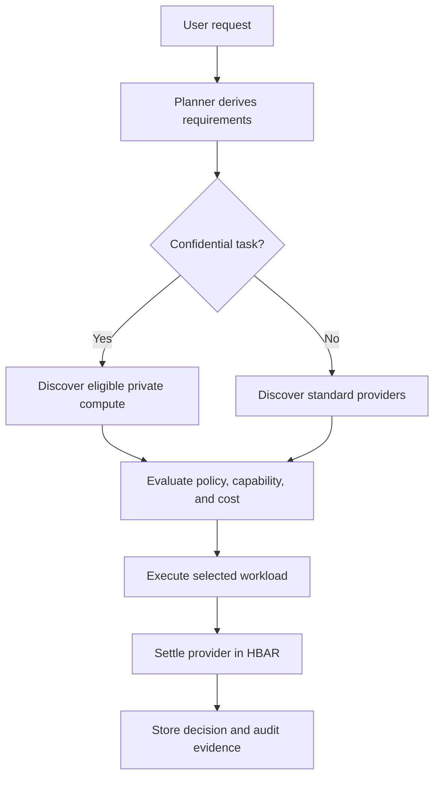

# AgentRouter

AgentRouter is a policy-driven commerce routing layer for autonomous AI agents.
It enables an agent to discover services, compare providers, enforce execution
policies, execute workloads, settle payments, and preserve an auditable record
of every decision.

Rather than focusing only on how an agent pays, AgentRouter focuses on how an
agent decides to spend.

> Project status: the application scaffold and deterministic commerce-domain
> routing contracts are implemented. Durable storage, live provider discovery,
> execution, and external integrations remain planned until linked to a commit
> and marked complete in [TODO.md](TODO.md).

## Problem

Most AI agents depend on hardcoded APIs and predefined workflows. They cannot
reliably:

- discover available providers dynamically;
- compare cost, privacy, and capabilities;
- choose the best execution environment;
- enforce a delegated spending budget; or
- produce verifiable decisions and payment receipts.

As agents become more autonomous, they need an economic decision layer between
planning and execution.

## Solution

For every task, AgentRouter will:

1. understand the user's request;
2. derive execution requirements and policy constraints;
3. discover eligible providers;
4. evaluate cost, privacy, capabilities, and budget;
5. select the best feasible provider with structured decision evidence;
6. execute the workload;
7. settle payment in HBAR; and
8. record the routing decision, execution result, and payment receipt.

The target commerce loop is:

> discover → compare → select → execute → pay → verify → record

## Decision engine

The planner evaluates:

- available budget and per-transaction limits;
- quoted cost;
- confidentiality and data-handling requirements;
- provider capabilities;
- execution-policy constraints; and
- expected latency and delivery requirements.

A confidential task, for example, should make privacy a hard constraint rather
than a soft ranking preference:



The final implementation must persist the considered providers, exclusion
reasons, selected provider, policy snapshot, and price—not only a prose
explanation.

The implemented policy engine currently:

- validates typed jobs, requirements, policies, providers, offers, quotes,
  decisions, challenges, payments, deliveries, receipts, and events;
- stores fiat prices as integer minor units and HBAR values as exact decimal
  strings;
- rejects candidates that violate budget, privacy, capability, currency, or
  quote-expiry constraints; and
- ranks eligible candidates deterministically by price, expected latency,
  provider ID, and offer ID.

Provider discovery remains fixture/test input until Phase 3. Persistence and
model-derived requirements remain planned for Phases 2 and 4 respectively.

## Target architecture

| Layer                | Planned technology                | Responsibility                                          |
| -------------------- | --------------------------------- | ------------------------------------------------------- |
| Frontend             | Next.js, TypeScript, Tailwind CSS | Task input, policy, progress, result, receipts          |
| Planner              | Vercel AI SDK                     | Requirement extraction and structured routing decision  |
| Application database | Supabase/Postgres                 | Durable jobs, policies, quotes, decisions, and receipts |
| Provider discovery   | The Graph                         | Indexed provider and capability discovery               |
| Private execution    | 0G Compute / Private Compute      | Confidential workload execution                         |
| Settlement and audit | Hedera                            | HBAR payment, HCS audit events, HashScan evidence       |

See [Architecture](docs/ARCHITECTURE.md) for system boundaries, state
transitions, and trust assumptions.

## Sponsor integrations

Official ETHGlobal Lisbon 2026 prize pages:

- [0G prizes](https://ethglobal.com/events/lisbon2026/prizes/0g)
- [Hedera prizes](https://ethglobal.com/events/lisbon2026/prizes/hedera)
- [The Graph prizes](https://ethglobal.com/events/lisbon2026/prizes/the-graph)

### Hedera

Hedera is the settlement and public-audit layer:

- HBAR provider payments;
- mirror-node payment verification;
- HCS lifecycle and routing-decision anchors; and
- public transaction evidence through HashScan.

### 0G

0G is the planned private-execution option. When a policy marks a request or
its data confidential, only providers satisfying the private-compute
requirement remain eligible.

### The Graph

The Graph is the planned discovery layer. The planner should query an indexed
provider registry instead of relying exclusively on providers hardcoded into
the application.

Sponsor integrations remain planned until their corresponding TODO items and
tests are complete.

See [ETHGlobal Lisbon 2026 prize strategy](docs/PRIZE_STRATEGY.md) for the
selected tracks, qualification gates, required evidence, and final submission
checklist.

## Attribution

AgentRouter was initialized as a fresh repository and did not use a third-party
application starter. The repository baseline, validation-lab boundary,
third-party packages, and ongoing disclosure rule are recorded in
[Attribution and project baseline](docs/ATTRIBUTION.md).

## Demo target

1. The user submits a task, budget, and privacy policy.
2. The planner derives structured requirements.
3. The Graph returns multiple eligible providers.
4. The planner rejects policy violations and selects the best feasible offer.
5. A sensitive workload routes to 0G private execution.
6. The selected provider is paid in HBAR.
7. Hedera records auditable payment and routing evidence.
8. The user receives the result, selection explanation, spend summary, and
   verifiable receipt.

The demo must make the economic decision visible: alternatives existed, policy
changed eligibility, and the agent selected a provider without a hardcoded
branch.

## Development workflow

This repository intentionally uses small, chronological commits. Read
[AGENTS.md](AGENTS.md) before making changes. Every independently verifiable
milestone receives its own commit after relevant checks pass.

Install dependencies and run the canonical validation gate:

```sh
npm install
npm run validate
```

The gate checks formatting, lint rules, TypeScript, tests, and the production
build.

Copy the safe environment template for local development:

```sh
cp .env.example .env.local
```

Only variables beginning with `NEXT_PUBLIC_` may be read by browser code.
Operator keys, model keys, Supabase secret keys, and all future payment
credentials are server-only. The typed contracts in `src/lib/env` reject
unknown or malformed configuration. Empty optional credentials keep the
scaffold usable before those integrations are implemented.

Implementation progress and acceptance criteria live in [TODO.md](TODO.md).

### Supabase migrations

The durable commerce schema, ownership-aware row-level security, uniqueness
guards, and atomic workflow functions live in `supabase/migrations`. Validate
the configured database without applying changes with:

```sh
npm run validate:supabase
```

Apply reviewed migrations with `supabase db push --db-url "$SUPABASE_DB_URL"`.
The atomic functions require an authenticated Supabase user; privileged
credentials remain server-only.

## Vision

AgentRouter is infrastructure for agents that must discover, negotiate,
execute, pay, and verify external services autonomously. Its goal is to make
those economic decisions bounded by human policy, explainable to users, and
auditable after execution.
