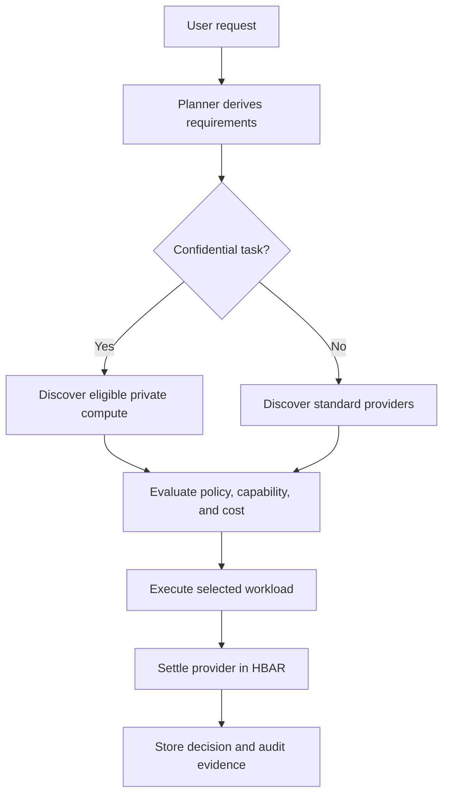

# AgentRouter

AgentRouter is a reusable, policy-driven model-routing and provenance toolkit
for agents built on 0G. It lets developers discover hosted models, compare
routes, execute inference, and preserve independently verifiable routing
evidence.

The repository also contains a small example application that exercises the
toolkit end to end. The application demonstrates the infrastructure; it is not
the primary submission artifact.

Rather than focusing only on how an agent pays, AgentRouter focuses on how an
agent decides to spend.

> Project status: the reusable toolkit, live 0G Compute path, 0G Storage
> adapter, canonical receipt, minimal 0G Chain contract, deterministic router,
> and external example agent are implemented. The complete private Compute,
> Aristotle Storage, receipt-anchor, and independent-verification path is
> verified live and recorded in [docs/0G_PHASE5.md](docs/0G_PHASE5.md).

Live 0G Compute Router configuration, privacy controls, and redacted execution
evidence are recorded in
[docs/0G_COMPUTE_EVIDENCE.md](docs/0G_COMPUTE_EVIDENCE.md).
The complete Phase 5 SDK, network, receipt, deployment, and verification
contract is recorded in [docs/0G_PHASE5.md](docs/0G_PHASE5.md).

Submission quick links:

- [live application](https://www.router.fexhu.com);
- [demo and submission runbook](docs/DEMO_RUNBOOK.md);
- [architecture and trust boundaries](docs/ARCHITECTURE.md);
- [working external example agent](examples/0g-agent.ts); and
- [production deployment](docs/PRODUCTION_DEPLOYMENT.md).

## 0G Infrastructure track scope

The target is **Best Infrastructure & Tooling on 0G**, specifically a
**model-routing or provenance layer across 0G-hosted models, with verification
tracked on-chain**. The shipped artifact must expose reusable APIs that another
agent can import without depending on the example UI.

The minimum reusable surface will include:

- a model catalog and quote-normalization contract for at least two comparable
  0G-hosted model routes;
- deterministic routing by capability, exact integer price, privacy, latency,
  and caller-supplied policy;
- a 0G Compute adapter with explicit execution provenance;
- a 0G Storage adapter for non-secret evidence or memory references;
- a canonical routing receipt anchored and independently verified on 0G Chain;
  and
- one documented example agent built only through the public toolkit API.

Agentic ID is optional. If implemented, it identifies the calling agent and is
bound into the receipt; it is not a prerequisite for the core routing proof.

## Problem

Most AI agents depend on hardcoded APIs and predefined workflows. They cannot
reliably:

- discover available providers dynamically;
- compare cost, privacy, and capabilities;
- choose the best execution environment;
- enforce a delegated spending budget; or
- produce verifiable decisions and payment receipts.

As agents become more autonomous, they need an economic decision layer between
planning and execution.

## Solution

For every task, AgentRouter will:

1. understand the user's request;
2. derive execution requirements and policy constraints;
3. discover eligible providers;
4. evaluate cost, privacy, capabilities, and budget;
5. select the best feasible provider with structured decision evidence;
6. execute the workload;
7. settle payment in HBAR; and
8. record the routing decision, execution result, and payment receipt.

The target commerce loop is:

> discover → compare → select → execute → pay → verify → record

## Decision engine

The planner evaluates:

- available budget and per-transaction limits;
- quoted cost;
- confidentiality and data-handling requirements;
- provider capabilities;
- execution-policy constraints; and
- expected latency and delivery requirements.

A confidential task, for example, should make privacy a hard constraint rather
than a soft ranking preference:



The final implementation must persist the considered providers, exclusion
reasons, selected provider, policy snapshot, and price—not only a prose
explanation.

The implemented policy engine currently:

- validates typed jobs, requirements, policies, providers, offers, quotes,
  decisions, challenges, payments, deliveries, receipts, and events;
- stores fiat prices as integer minor units and HBAR values as exact decimal
  strings;
- rejects candidates that violate budget, privacy, capability, currency, or
  quote-expiry constraints; and
- ranks eligible candidates deterministically by price, expected latency,
  provider ID, and offer ID.

Provider discovery uses one normalized contract for deterministic fixtures and
live indexed records. The selected source is explicit, and live results retain
deployment, network, endpoint, block, and query-time provenance. Model-derived
requirements and candidate assessments use the Vercel AI SDK with Scaleway
Generative APIs. The deterministic policy engine independently revalidates
eligibility, budget, quote expiry, ranking, and selection.

## Target architecture

| Layer               | Planned technology                  | Responsibility                                            |
| ------------------- | ----------------------------------- | --------------------------------------------------------- |
| Toolkit API         | TypeScript package + typed adapters | Reusable routing, execution, and verification primitives  |
| Example application | Next.js, TypeScript, Tailwind CSS   | Demonstrate one agent using only the public toolkit API   |
| Policy router       | Deterministic TypeScript core       | Compare 0G model routes under caller-supplied constraints |
| Model execution     | 0G Compute                          | Execute inference and retain execution provenance         |
| Evidence / memory   | 0G Storage                          | Store non-secret artifacts and content-addressed evidence |
| Provenance anchor   | 0G Chain                            | Anchor and verify canonical routing-receipt hashes        |
| Durable state       | Supabase/Postgres                   | Jobs, policies, quotes, decisions, and receipts           |
| Optional discovery  | The Graph                           | Index external provider-registry metadata                 |
| Optional settlement | Hedera                              | HBAR payment and an additional public audit trail         |

See [Architecture](docs/ARCHITECTURE.md) for system boundaries, state
transitions, and trust assumptions.

## Sponsor integrations

Official ETHGlobal Lisbon 2026 prize pages:

- [0G prizes](https://ethglobal.com/events/lisbon2026/prizes/0g)
- [Hedera prizes](https://ethglobal.com/events/lisbon2026/prizes/hedera)
- [The Graph prizes](https://ethglobal.com/events/lisbon2026/prizes/the-graph)

### Hedera

Hedera is the settlement and public-audit layer:

- HBAR provider payments;
- mirror-node payment verification;
- HCS lifecycle and routing-decision anchors; and
- public transaction evidence through HashScan.

### 0G

0G is the load-bearing platform for the primary submission: model execution
comes from 0G Compute, non-secret evidence or memory references come from 0G
Storage, and routing-receipt hashes are verified on 0G Chain. Privacy remains
a hard constraint, but the integration must prove routing and provenance—not
merely call one private-execution endpoint.

### The Graph

The Graph adapter supports cross-chain provider discovery from a small provider
registry on a supported EVM network, initially Base Sepolia. Registry records
describe providers that execute and settle elsewhere: capability, execution
network, endpoint, Hedera settlement account, exact price, privacy support, and
active status. A live provider-registry deployment is planned but not yet
claimed.

The discovery adapter posts `DiscoverProviders` to a configured Graph endpoint,
normalizes active offers into the same provider/offer/quote contract used by
fixtures, and rejects empty, stale, malformed, or unavailable results without
silently falling back. The indexed entity contract is
[`graph/schema.graphql`](graph/schema.graphql).

Use `DISCOVERY_SOURCE=fixture` for the deterministic local path. For live
discovery, set `DISCOVERY_SOURCE=the-graph`, `GRAPH_ENDPOINT`,
`GRAPH_DEPLOYMENT_ID`, and `GRAPH_NETWORK`; optionally set a server-only
`GRAPH_ACCESS_TOKEN`. `GRAPH_MAX_STALENESS_MS` defaults to five minutes.
Fixture results are labeled `fixture`, while live results are labeled
`the-graph`.

The schema and query adapter are implemented, but a live registry deployment
identifier is intentionally not claimed until a registry contract is indexed
and its deployment evidence is recorded.

The Graph never verifies Hedera payments and does not directly index native HBAR
transfers as settlement truth. Hedera payment verification uses Mirror Node
infrastructure, atomic application credit lives in Postgres, and execution
evidence comes from the 0G integration.

The planned monitoring path projects only independently Mirror-verified,
non-secret Hedera event references through an allowlisted relayer to a local
Ganache EVM, where a local Graph Node can index them. This asynchronous
projection must not create, duplicate, reverse, or delay spendable application
credit. It is explicitly relayer-mediated monitoring evidence, not native
cross-chain verification. The Base Sepolia references elsewhere in this README
belong to the separate provider-discovery registry. The earlier direct-Hedera
Graph Node deployment is retained as experimental evidence after its JSON-RPC
Relay could not provide every receipt required to construct canonical blocks.

### Local Hedera monitoring relay

Phase 6B uses a disposable Ganache chain on loopback, with chain ID `1337`.
Start the chain and deploy the replay-protected anchor contract in separate
terminals:

```sh
cp .env.example .env
npm run evm:local
```

```sh
npm run deploy:hedera-anchor:local
```

The deployment uses separate unlocked Ganache accounts for the deployer and
allowlisted relayer. It refuses non-loopback RPC endpoints and unexpected chain
IDs, waits for a successful deployment receipt, and prints non-secret evidence
including the contract address, transaction hash, block, and relayer address.
The chain is ephemeral: stopping and restarting Ganache invalidates the prior
contract address.

See the
[Phase 6B local relay runbook](docs/PHASE6B_HEDERA_PROJECTION.md#local-deployment)
for configuration, expected output, verification, shutdown behavior,
troubleshooting, and security boundaries.

See [ETHGlobal Lisbon 2026 prize strategy](docs/PRIZE_STRATEGY.md) for the
selected tracks, qualification gates, required evidence, and final submission
checklist.

## Attribution

AgentRouter was initialized as a fresh repository and did not use a third-party
application starter. The repository baseline, validation-lab boundary,
third-party packages, and ongoing disclosure rule are recorded in
[Attribution and project baseline](docs/ATTRIBUTION.md).

## Demo target

1. The user submits a task, budget, and privacy policy.
2. The planner derives structured requirements.
3. The Graph queries the Base Sepolia provider registry and returns multiple
   eligible cross-chain providers.
4. The planner rejects policy violations and selects the best feasible offer.
5. A sensitive workload routes to 0G private execution.
6. The selected provider is paid in HBAR.
7. Hedera records auditable payment and routing evidence.
8. The user receives the result, selection explanation, spend summary, and
   verifiable receipt.

The demo must make the economic decision visible: alternatives existed, policy
changed eligibility, and the agent selected a provider without a hardcoded
branch.

## Development workflow

This repository intentionally uses small, chronological commits. Read
[AGENTS.md](AGENTS.md) before making changes. Every independently verifiable
milestone receives its own commit after relevant checks pass.

Install dependencies and run the canonical validation gate:

```sh
npm install
npm run validate
```

The gate checks formatting, lint rules, TypeScript, tests, and the production
build.

Copy the safe environment template for local development:

```sh
cp .env.example .env.local
```

Only variables beginning with `NEXT_PUBLIC_` may be read by browser code.
Operator keys, model keys, Supabase secret keys, and all future payment
credentials are server-only. The typed contracts in `src/lib/env` reject
unknown or malformed configuration. Empty optional credentials keep the
scaffold usable before those integrations are implemented.

### Scaleway planner

Set `SCALEWAY_GENAI_API_KEY` in the server environment to enable planning.
`SCALEWAY_GENAI_BASE_URL` defaults to Scaleway's OpenAI-compatible
`https://api.scaleway.ai/v1` endpoint, `SCALEWAY_GENAI_MODEL` selects the
deployed or serverless model, and `PLANNER_TIMEOUT_MS` defaults to 15 seconds.

The server entry point is `planRouteWithScaleway` in
`src/lib/planner/server.ts`. It asks Scaleway for schema-constrained requirement
and assessment objects. A timeout, invalid schema, missing candidate, duplicate
candidate, or unavailable model activates deterministic fallback evidence.
Model scores never override hard policy or integer budget checks.

Implementation progress and acceptance criteria live in [TODO.md](TODO.md).

### Supabase migrations

The durable commerce schema, ownership-aware row-level security, uniqueness
guards, and atomic workflow functions live in `supabase/migrations`. Planner
persistence updates the extracted requirement, stores candidates, exclusions,
scores, rationales, selection, policy snapshot, and fallback provenance in one
transaction; a selected quote is revalidated and reserved atomically. Validate
the configured database without applying changes with:

```sh
npm run validate:supabase
```

Apply reviewed migrations with `supabase db push --db-url "$SUPABASE_DB_URL"`.
The atomic functions require an authenticated Supabase user; privileged
credentials remain server-only.

### Hedera settlement and audit

Phase 6 implements a versioned `402` challenge, exact tinybar validation,
budget-before-transfer ordering, one-shot testnet settlement, separate
submitted/consensus/mirror states, strict Mirror Node proof checks, replay
rejection, and compact HCS decision/receipt anchors. Ambiguous outcomes enter
reconciliation and never trigger another transfer automatically.

The guarded live command creates a new testnet payment on every invocation:

```sh
npm run demo:hedera
```

Use it only with disposable testnet accounts and a deliberately trivial
`HEDERA_TRANSFER_HBAR`. The verified Phase 6 run and public HashScan evidence
are recorded in [Hedera testnet evidence](docs/HEDERA_TESTNET_EVIDENCE.md).

### Prepaid HBAR application credit

Phase 6A adds the customer-funded path: the app returns a bound HBAR deposit
intent for the user's wallet to sign, verifies the resulting transfer through
Mirror Node, and atomically consumes that proof into an exact-tinybar
application ledger. The app's separately pre-funded 0G inventory pays the 0G
network; no direct or automatic HBAR-to-0G conversion is claimed. Projection
and Graph monitoring lag are visible but never control spendable credit.

The state model, security boundaries, reconciliation procedure, and validation
commands are documented in the
[Phase 6A prepaid credit runbook](docs/PHASE6A_PREPAID_CREDIT.md).

The optional self-hosted app-event history path is documented in the
[Hedera Subgraph production runbook](docs/HEDERA_SUBGRAPH_PRODUCTION.md). It is
a monitoring projection and never replaces Mirror Node payment verification.

## Vision

AgentRouter is infrastructure for agents that must discover, negotiate,
execute, pay, and verify external services autonomously. Its goal is to make
those economic decisions bounded by human policy, explainable to users, and
auditable after execution.
