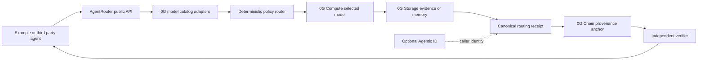

# AgentRouter Architecture

This document is the current AgentRouter design. The inherited technical
evidence is summarized in [Validation Baseline](VALIDATION_BASELINE.md), and the
recommended build sequence is in
[Implementation Handoff](IMPLEMENTATION_HANDOFF.md). Those documents adapt the
validation lab without replacing AgentRouter's newer The Graph and 0G design.

## Product boundary

AgentRouter's primary artifact is a reusable TypeScript model-routing and
provenance toolkit for 0G. It owns catalog normalization, policy evaluation,
routing, 0G Compute invocation, 0G Storage evidence references, canonical
receipts, and 0G Chain verification. The Next.js experience is a working
example built on the toolkit, not the product boundary.

Hedera settlement and The Graph discovery demonstrate adapter extensibility,
but neither may replace a load-bearing 0G Compute, Storage, and Chain path.

## 0G-native toolkit flow



The public API must be usable without importing UI, database, Hedera, or The
Graph modules. Platform adapters implement narrow contracts so other teams can
add catalogs, policies, storage strategies, and verifiers.

## System responsibilities

| Component         | Owns                                                  | Must not own                      |
| ----------------- | ----------------------------------------------------- | --------------------------------- |
| Browser           | User intent, policy input, progress, receipts         | Payment keys or server secrets    |
| Planner           | Typed requirements and proposed routing decision      | Direct authority to bypass policy |
| Policy engine     | Eligibility, budget checks, deterministic ranking     | Free-form model reasoning         |
| Discovery adapter | Provider and offer retrieval                          | Provider selection                |
| Execution adapter | Typed workload invocation and delivery                | Payment authorization             |
| Payment service   | Challenge validation, HBAR settlement, reconciliation | Product workflow state            |
| Postgres          | Durable operational state and idempotency             | Settlement truth                  |
| Hedera            | Settlement truth and public audit anchors             | Full application state            |
| SSE endpoint      | Projection of persisted workflow events               | Authoritative in-memory state     |

## Durable lifecycle

```text
created
  → requirements_ready
  → providers_discovered
  → quotes_evaluated
  → provider_selected
  → execution_requested
  → payment_required
  → payment_submitted
  → payment_confirmed_mirror_pending
  → payment_verified
  → execution_completed
  → receipt_recorded
```

Terminal failure states must include a stable reason code and distinguish
retryable execution failures from permanent policy or payment failures.

## Routing decision contract

The routing decision should be schema-valid data containing at least:

```json
{
  "requirementId": "req_...",
  "selectedProviderId": "prv_...",
  "selectedOfferId": "off_...",
  "policyVersion": 1,
  "quotedAmountMinor": 12,
  "currency": "EUR",
  "privacyClass": "confidential",
  "considered": [
    {
      "providerId": "prv_...",
      "eligible": false,
      "reasonCodes": ["PRIVATE_COMPUTE_REQUIRED"]
    }
  ]
}
```

The model may derive requirements and explain a choice, but hard policy
constraints and budget arithmetic must be enforced deterministically.

## Planner model boundary

The server creates an AI SDK OpenAI-compatible provider pointed at Scaleway
Generative APIs. Both model calls use strict Zod output contracts:

1. extract one typed requirement from the objective; and
2. score and explain every discovered candidate.

The model cannot set eligibility, exclusion reason codes, rank, or selection.
Those fields come from the deterministic policy engine after it checks
capability, privacy class, currency, integer minor-unit budgets, transaction
limits, and quote expiry. Model timeouts, invalid objects, incomplete
candidate coverage, and duplicate candidate evaluations are recorded as
fallback evidence.

The `persist_planner_decision` database transaction locks the job, updates the
owned requirement, verifies the exact policy version, stores the full decision
and evidence, and—when there is a selection—revalidates the provider/offer/quote
binding before accepting the quote and reserving budget. Its idempotency key
prevents a retry from reserving funds twice.

## Discovery

The source of truth for advertised provider metadata is a minimal registry
contract on a Graph-supported EVM chain, initially Base Sepolia. The registry
describes cross-chain services; a provider may execute on 0G and receive HBAR
on Hedera without the registry chain becoming its execution or settlement
network.

The Graph indexes registry events and exposes provider records and versioned
offers through GraphQL. The adapter normalizes those results into the same
contract used by deterministic fixtures. Fixture-backed discovery must be
labeled clearly in the UI and documentation.

Required provider attributes include:

- stable provider and offer identifiers;
- capabilities and supported input/output types;
- privacy/execution classifications;
- price and settlement terms;
- expected latency;
- quote expiry; and
- Hedera settlement identity.

The discovery Subgraph boundary is deliberately narrow. It does not verify or
directly index native Hedera HBAR transfers, HCS messages, 0G inference events,
private prompts, or results. Hedera Mirror Node data and 0G execution evidence
enter AgentRouter through their own adapters and retain separate provenance.

A separate, asynchronous monitoring projection may relay an independently
Mirror-verified, non-secret Hedera event reference to Base Sepolia for Graph
indexing. The allowlisted relayer is an explicit trust boundary, and the
destination event is not native cross-chain verification. Mirror verification
plus atomic Postgres proof consumption is the only path to application credit;
projection or indexer lag cannot create, duplicate, reverse, or delay spendable
funds.

```text
Base Sepolia registry → The Graph → discovery and selection
0G integration                    → private execution
Hedera SDK / Mirror Node / HCS    → settlement and audit
Mirror-verified Hedera reference  → Base Sepolia → The Graph monitoring
```

## Private execution

Confidentiality is a hard eligibility constraint. When a requirement is marked
confidential:

1. exclude providers that cannot satisfy the private-execution policy;
2. route the typed workload through the 0G adapter;
3. avoid logging raw confidential prompts or artifacts;
4. persist only the minimum audit metadata; and
5. keep private artifacts behind short-lived authorized access.

The implementation must verify what privacy guarantees the chosen 0G service
actually provides before making claims in the UI or submission.

## Payment and verification

The paid-provider contract follows a versioned challenge-and-retry flow:

1. provider returns `402 Payment Required`;
2. server validates quote, network, asset, amount, recipient, memo, and expiry;
3. policy engine confirms the reservation remains valid;
4. payment service submits one HBAR transfer;
5. UI shows consensus separately from mirror verification;
6. provider verifies the finalized mirror-node record;
7. proof consumption and receipt creation occur atomically; and
8. retries return the original result instead of paying again.

Never submit another transfer solely because mirror indexing or provider
execution is delayed.

## Audit model

Postgres stores the complete operational record. HCS stores compact,
non-sensitive audit anchors such as:

- job and decision identifiers;
- event type and timestamp;
- hashes of canonical decision or receipt payloads; and
- relevant Hedera transaction identifiers.

Do not publish prompts, private artifacts, personal data, API keys, or payment
credentials to HCS.

## Browser updates

Persist each event before broadcasting it through SSE. On reconnect, the
browser reloads the durable timeline and resumes from the last event identifier.
Supabase Realtime is not required for the MVP.

## Failure behavior

Fail closed on:

- insufficient delegated or on-chain balance;
- no policy-compliant provider;
- expired or mismatched quote/challenge;
- duplicate transaction proof;
- ambiguous settlement;
- mirror-node timeout;
- provider timeout; and
- invalid or incomplete delivery.

Payment ambiguity enters reconciliation. It must never automatically create a
second payment.

## Initial deployment boundary

The Next.js application and server routes are intended for Vercel. Supabase,
Hedera, The Graph, and 0G remain external systems. All privileged credentials
stay in server-only environment variables and must not be referenced by client
components.

## Validation boundary

Hedera settlement, mirror verification, HCS, structured model output, Supabase
server-side CRUD, browser SSE, and core failure behavior were proven separately
in the validation lab. AgentRouter must still implement and test those contracts
inside its own durable architecture.

The Graph discovery and 0G private execution are AgentRouter additions and have
not been validated by the lab. They remain planned until their live adapters,
failure handling, and acceptance tests are complete.
